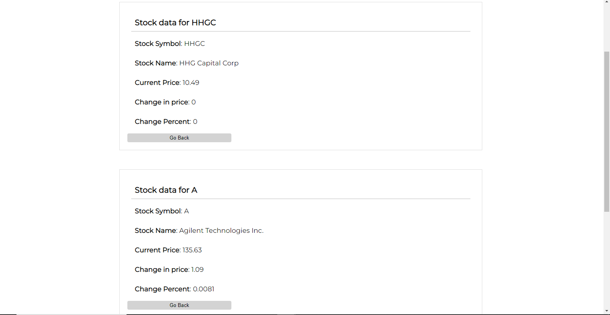

<h1 align="center"> :chart_with_downwards_trend: Real Time Stock Prices :chart_with_upwards_trend: </h1>

 

<h2>Instructions</h2>
    <p>
    Using React or Vue.js, create a responsive dashboard that displays real-time stock prices from a 
    public api such as <a href="https://iexcloud.io/" alt="iexcloud.io">IEX Cloud</a>
    </p>
    <p>
    The dashboard should include a search bar that allows users to search for stock symbols, and the
    dashboard should display the current price, change in price, and percentage change for each stock.
    </p>
<ul style="list-style-type: none; padding: 0px">
    <h3>Using:</h3>
    <li>Library: React Js</li>
    <li>Api: <a href="https://iexcloud.io/" alt="iexcloud.io">IEX Cloud</a>
</ul>

### Installation:

The dashboard can be installed by cloning this repository to your terminal
With Git:

```commandline
$ git clone https://github.com/micoliser/stock-prices.git
```

Or using wget and unzip:

```commandline
$ wget https://github.com/micoliser/stock-prices/archive/refs/heads/master.zip
```

Then unzip the downloaded file

```commandline
$ unzip master.zip
```

---

### Usage:

To use the dashboard, run the command; (Dashboard will be opened Default Browser)

```commandline
$ cd stock-prices
$
$ npm start
$
```

---

## The Dashboard


The dashboard is opened after running `npm start` from the terminal and
displays the first 100 stocks by default.

#### The Dashboard search bar features

It supports typing suggestions based on user input (first 50 stocks, completes text on click).<br>


#### Dashboard Results

Dashboard results show the current price, change in price, and percentage change for each stock.


Allows for multiple search


When data is not found


---

NOTE: Full dashboard data takes approximately 10 seconds to load, Check network if loading takes longer.

---
